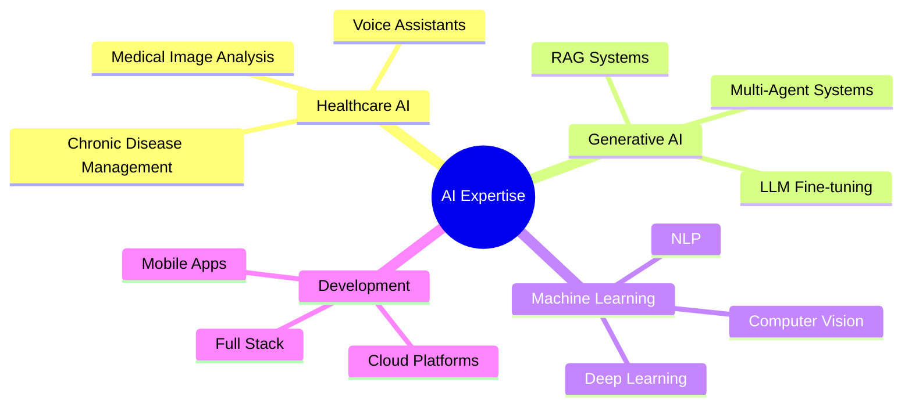

# Hi there, I'm Nandini Kuppala! 👋

<div align="center">
  
</div>

<div align="center">
  
</div>

## 🎯 About Me


🎓 **AI Engineering Student** at Amrita Vishwa Vidyapeetham (CGPA: 8.16)  
🚀 **Gen AI Specialist** with expertise in Healthcare AI  
🏆 **1st Runner Up** - Asha AI Hackathon (VEGA Project)  
🌟 **Top 25 Startup** - ThingQbator Cohort 7 (NASSCOM & Cisco)  
🏥 **Healthcare AI Innovator** - Finalist at Johns Hopkins Health Hackathon  

```python
class NandiniKuppala:
    def __init__(self):
        self.role = "AI Engineer & Healthcare Innovator"
        self.location = "Coimbatore, Tamil Nadu, India"
        self.current_focus = ["Generative AI", "Healthcare AI", "LLM Fine-tuning"]
        self.passion = "Building AI solutions that make healthcare accessible"
    
    def get_current_projects(self):
        return ["NurtureSync - AI Healthcare Platform", 
                "VEGA - AI Career Companion",
                "Rangeland Vegetation Monitoring"]
    
    def say_hi(self):
        print("Thanks for dropping by! Let's build something amazing together! 🚀")
```

## 🏆 Recent Achievements

<div align="center">

| 🥈 **1st Runner Up** | 🚀 **Top 25 Startup** | 🏥 **Health Hackathon Finalist** |
|:---:|:---:|:---:|
| Asha AI Hackathon | ThingQbator Cohort 7 | Johns Hopkins University |
| VEGA Project | 1,000+ teams | Selected from 232 teams |

</div>

## 💼 Professional Experience

<details>
<summary><b>🔥 Gen AI Intern - Orange League Ventures (Mar-May 2025)</b></summary>
<br>

- 🤖 Built AI-powered skill assessment system with **one-click candidate evaluation**
- 📊 Developed multi-stage evaluation pipeline analyzing **resumes, GitHub, and LeetCode profiles**
- 🎯 Created objective scoring system for hiring decisions with **AI-evaluated summaries**

**Tech Stack:** `Python` `Streamlit` `Beautiful Soup` `Crew AI`
</details>

<details>
<summary><b>👥 Project Team Lead - NASSCOM Cohort 7 (Jul 2024-Mar 2025)</b></summary>
<br>

- 🏥 Developed **NurtureSync** - AI healthcare platform for chronic disease management
- 🗣️ Integrated **multilingual voice assistant** with emotion recognition and RAG-based responses
- 🔬 Implemented **multi-agent system** for medicine analysis using OCR
- 📱 Managing **closed testing** on Google Play Store with 25 active users

**Tech Stack:** `Flutter` `Python` `FastAPI` `MongoDB` `Firebase` `GCP`
</details>

<details>
<summary><b>🤖 AI Project Intern - Infosys Springboard (Dec 2024-Feb 2025)</b></summary>
<br>

- 🎫 Built AI-driven **customer support ticket classification** system
- ⚡ **Reduced ticket resolution time by 40%** with automated response generation
- 🧠 Created dynamic response engine with intelligent query routing

**Tech Stack:** `Streamlit` `Zapier` `Pinecone` `Groq` `MongoDB`
</details>

## 🛠️ Tech Stack & Skills

<div align="center">

### 🚀 Core Technologies


### 🤖 AI/ML Frameworks


### 🌐 Web & Mobile


### ☁️ Cloud & Databases


</div>

## 🚀 Featured Projects

<div align="center">
  
</div>

### 🏥 [NurtureSync - AI Healthcare Platform](your-project-link)
> **Chronic Disease Management with AI Voice Assistant**

- 🗣️ **Multilingual Voice Bot** supporting 10 Indian languages with real-time audio processing
- 🧠 **RAG System** with Mistral 8×7B LLM and fine-tuned BioMistral
- 🎭 **Emotion Recognition** using fine-tuned Wav2Vec models (75% accuracy)
- 🔊 **ASR-LLM-TTS Pipeline** with ECAPA-TDNN speaker verification

**Tech:** `Python` `Hugging Face` `Wav2Vec2` `Mistral` `Sarvam ASR` `Google TTS` `RAG` `MongoDB` `FastAPI`

---

### 👩‍💼 [VEGA - AI Career Companion](your-project-link)
> **Empowering Women's Return to Work with AI**

- 🌍 **Multilingual Support** for 10 Indian languages with voice capabilities
- 💼 **Job Recommendation Engine** aggregating from Naukri, Indeed, and Herkey
- 📄 **ATS-Optimized Resume Builder** with 96% ATS pass rate
- 📈 **43% improvement** in interview call rates
- 🤖 **Multi-Agent Architecture** with reinforcement learning (38% reduction in API calls)

**Tech:** `NLP` `Agentic RAG` `MCP` `Selenium` `LangChain` `CrewAI` `Gemini` `Groq` `Pinecone`

---

### 🛡️ [Healthcare Chatbot Testing Framework](your-project-link)
> **Automated Testing & Security for Healthcare AI**

- 🔧 **Automated Testing Framework** using Mocha, Python, and Selenium
- 🚀 **30% Speed Enhancement** with Nginx load balancing
- 🔒 **Security Testing** with OWASP ZAP - identified and fixed 8 critical vulnerabilities

**Tech:** `Selenium` `Mocha` `React` `Express` `Docker` `Nginx` `OWASP ZAP`

## 📊 GitHub Analytics

<div align="center">
  
  
</div>

<div align="center">
  
</div>

<div align="center">
  
</div>

## 📚 Publications & Research

<div align="center">

| 📖 **Publication** | 🏛️ **Venue** | 🔗 **Link** |
|:---|:---|:---:|
| Mapping Vegetation Dynamics in Wyoming | ASPRS International Technical Symposium 2024 | [📄](link) |
| Preterm Birth Prediction Using GraphSAGE | IEEE ICBSII Conference | [📄](link) |

</div>

## 🏅 Certifications

<div align="center">


-Infosys-green?style=for-the-badge)

</div>

## 📈 Contribution Activity

<div align="center">
  
</div>

## 🌟 Areas of Interest

<div align="center">



</div>

## 🤝 Let's Connect!

<div align="center">

[](your-linkedin)
[](your-github)
[](your-leetcode)
[](your-gfg)
[](your-hackerrank)
[](mailto:knandini7816@gmail.com)

</div>

---

<div align="center">
  
  
  ### "Building AI solutions that make healthcare accessible to everyone" 🌟
  
  
</div>

<div align="center">
  
</div>
