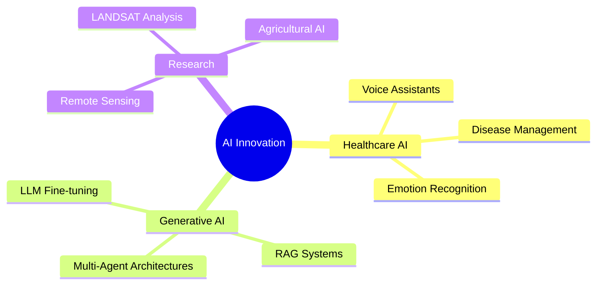

# 💫 Hey there! I'm Nandini Kuppala

<div align="center">
  
</div>

<div align="center">
  
</div>

## 🌟 About Me

```python
class NandiniKuppala:
    def __init__(self):
        self.name = "Nandini Kuppala"
        self.role = "AI Engineer & Gen AI Enthusiast"
        self.location = "Tamil Nadu, India"
        self.education = "B.E. AI @ Amrita Vishwa Vidyapeetham"
        self.current_focus = ["Healthcare AI", "Voice Technology", "LLM Fine-tuning"]
        
    def get_achievements(self):
        return [
            "🥈 1st Runner Up - Asha AI Hackathon (VEGA Project)",
            "🚀 Top 25 Startup - ThingQbator Cohort 7 (NASSCOM & Cisco)",
            "🏆 Finalist - Johns Hopkins Health Hackathon",
            "📚 Published Research - ASPRS & IEEE Conferences"
        ]
    
    def say_hi(self):
        print("Thanks for dropping by! Let's build something amazing together! 🚀")

me = NandiniKuppala()
me.say_hi()
```

<div align="center">
  
</div>

## 💼 Professional Experience

<table>
<tr>
<td width="50%">

### 🤖 **Gen AI Intern**
**Orange League Ventures** *(Mar 2025 - May 2025)*
- Built AI-powered skill assessment system
- Created multi-stage evaluation pipeline
- Developed intelligent candidate scoring

</td>
<td width="50%">

### 🏥 **Project Team Lead**
**NASSCOM ThingQbator Cohort 7** *(Jul 2024 - Mar 2025)*
- Developed NurtureSync healthcare platform
- Integrated multilingual voice assistant
- Managing 25+ active beta users

</td>
</tr>
<tr>
<td width="50%">

### 🎯 **AI Project Intern**
**Infosys Springboard** *(Dec 2024 - Feb 2025)*
- Automated customer support systems
- Reduced ticket resolution time by 40%
- Built dynamic response engines

</td>
<td width="50%">

### 🔬 **Research Experience**
**University of Wyoming & Amrita AI** *(Oct 2023 - Present)*
- Machine Learning with LANDSAT data
- Vegetation monitoring for Wyoming farmers
- Published research in ASPRS & IEEE

</td>
</tr>
</table>

## 🛠️ Tech Arsenal

<div align="center">

### 🧠 AI & Machine Learning


### 🌐 Development & Frameworks


### 🗄️ Databases & Cloud


</div>

<div align="center">
  
</div>

## 📊 GitHub Analytics

<div align="center">
  
  
</div>

<div align="center">
  
</div>

<div align="center">
  
</div>

## 🎯 Featured Projects

### 🏥 [NS MedBot - Voice Assistant for Chronic Disease Care](https://github.com/nandini-queen-of-my-world)


**Real-time conversational voice bot with multilingual support**
- 🗣️ ASR-LLM-TTS pipeline with speaker verification
- 🌍 Supports 10 Indian languages
- 🧠 RAG system with fine-tuned BioMistral
- 🎯 75% accuracy in emotion recognition
- **Tech:** Python, Hugging Face, Wav2Vec2, Mistral, MongoDB

### 🚀 [VEGA - AI Career Companion for Women](https://github.com/nandini-queen-of-my-world)


**🥈 1st Runner Up - Asha AI Hackathon Winner**
- 👩 Empowering women returning to work
- 🎤 Multilingual voice capabilities (10 languages)
- 📄 ATS-optimized resume builder (96% pass rate)
- 📈 43% improvement in interview call rates
- 🤖 Multi-agent architecture with RL optimization
- **Tech:** NLP, RAG, CrewAI, Gemini, Pinecone

<br clear="both"/>

<div align="center">
  
</div>

## 🏆 Achievements & Recognition

<div align="center">

| 🏅 Achievement | 🏛️ Organization | 📅 Year |
|:---|:---|:---:|
| 🥈 **1st Runner Up** - Asha AI Hackathon | JobsForHer Foundation | 2024 |
| 🚀 **Top 25 Startup** (from 1000+ teams) | NASSCOM & Cisco | 2024 |
| 🏆 **Health Hackathon Finalist** | Johns Hopkins University | 2024 |
| 📚 **Research Publication** | ASPRS Symposium | 2024 |
| 📚 **Research Publication** | IEEE ICBSII Conference | 2024 |

</div>

## 📈 Current Focus Areas

<div align="center">
  


</div>

## 🎓 Education & Certifications

<table align="center">
<tr>
<td>

**🎓 Education**
- 🏛️ **B.E. Artificial Intelligence**
- 🏫 Amrita Vishwa Vidyapeetham
- 📊 CGPA: 8.16/10
- 📅 2022 - 2026

</td>
<td>

**📜 Key Certifications**
- 🤖 Multi Agent Systems - DeepLearning.AI
- 🔥 Generative Models - Infosys Springboard
- 🧠 AI Course Series (118 hrs) - Infosys
- ⚡ Agile Scrum in Practice - Infosys

</td>
</tr>
</table>

## 🌐 Let's Connect & Collaborate!

<div align="center">
  
[](mailto:knandini7816@gmail.com)
[](https://linkedin.com/in/nandini-kuppala)
[](https://leetcode.com/nandini-kuppala)
[](https://geeksforgeeks.org/nandini-kuppala)
[](https://hackerrank.com/nandini-kuppala)


</div>

---

<div align="center">
  
### 💡 "Building AI solutions that make a difference, one line of code at a time!"


**Currently seeking exciting opportunities in AI/ML Engineering & Research!**


</div>

<div align="center">
  

**⭐ Star my repositories if you find them interesting!**
</div>
